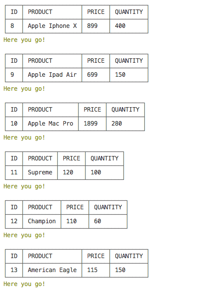

# Node.js & MySql Bamazon
## Overview

The app will take in orders from customers and deplete stock from the store's inventory. As a bonus task, you can program your app to track product sales across your store's departments and then provide a summary of the highest-grossing departments in the store.

Before using node.js, install all the packages in json file.
   
   

Create bAmazon database in MySQL.
 
   

Populate database with 10 more products in MySQL.

   

### Customer View
* The program will display all the products when customer runs at the first time

   
   
   

* Customer would be asked the question when purchasing products

   
   
* If our stock quantity does not meet customer's request, the application will show up insufficient quantity.

   
* Once we meet customer's request, the application will finish the purchase process.
   
   

### Manager View
* As a store's manager, the application could list a set of menu:

    
* View products of sales

    
     
* View low inventory

     
* Add to inventory

     
* Add new product

     

